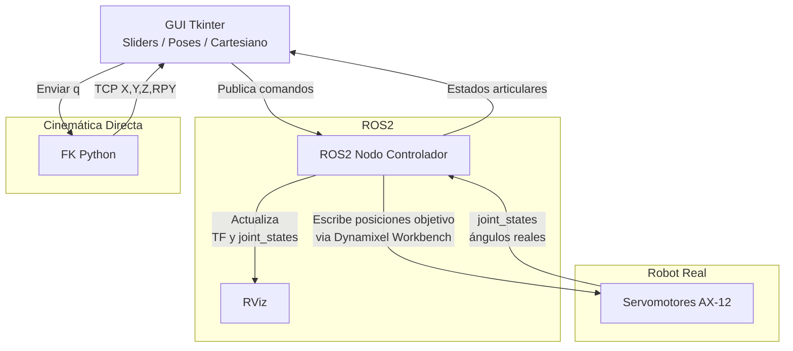

# 🤖 Laboratorio 05 – PhantomX Pincher X100  
### Robótica – 2025-II – Universidad Nacional de Colombia  
INTEGRANTES:
- Ariadna Contreras Nossa
- David Santiago Nagles Barajas

Este repositorio contiene el desarrollo completo del **Laboratorio No. 05**, incluyendo:

- Control del manipulador Phantom X Pincher utilizando **ROS 2 Humble + Dynamixel Workbench**  
- Interfaz gráfica (HMI) construida en **Tkinter + ROS2 Python**  
- Publicación/suscripción a tópicos de control  
- Movimiento secuencial entre poses  
- Control en espacio articular, numérico y cartesiano  
- Visualización en RViz en tiempo real  
- Cinemática directa en MATLAB (Robotics Toolbox)  
- Comparación entre modelo digital y robot real  

---

# 🧑‍🏫 **1. Objetivos del Laboratorio**
- Crear controladores articulares para los servos Dynamixel AX-12.  
- Manipular tópicos y servicios de cada joint controller.  
- Conectar Python + ROS2 con el PhantomX.  
- Validar límites articulares y enviar posiciones objetivo.  
- Graficar las poses en el Toolbox y compararlas con el robot real.  
- Construir una interfaz HMI con múltiples pestañas:
  - Control por sliders (articular)
  - Ingreso numérico
  - Control cartesiano
  - Vista RViz
  - Visualización numérica de la pose cartesiana  
  - Pestaña con las 5 poses del laboratorio  

---

# 🛠️ **2. Repositorios utilizados**
- https://github.com/labsir-un/ROB_Intro_ROS2_Humble_Phantom_Pincher_X100.git
- https://github.com/labsir-un/ROB_Intro_ROS2_Humble_Phantom_Pincher_X100_RVIZ.git

---

# 📏 **3. Mediciones y parámetros DH**

Las longitudes se midieron con calibrador, obteniendo los siguientes parámetros DH:

| Articulación | d (m) | a (m) | α (rad) | θ |
|--------------|-------|--------|----------|-----|
| 1 | 0.046 | 0 | +π/2 | q1 |
| 2 | 0 | 0.107 | 0 | q2 |
| 3 | 0 | 0.107 | 0 | q3 |
| 4 | 0 | 0.066 | 0 | q4 |

📌 Imagen del diagrama del robot:  
`/imgs/diagrama_DH_robot.png`

---

# 🦾 **4. Cinco poses solicitadas**

| Pose | q1 | q2 | q3 | q4 | q5 |
|------|----|----|----|----|----|
| 1 | 0 | 0 | 0 | 0 | 0 |
| 2 | 25 | 25 | 20 | -20 | 0 |
| 3 | -35 | 35 | -30 | 30 | 0 |
| 4 | 85 | -20 | 55 | 25 | 0 |
| 5 | 80 | -35 | 55 | -45 | 0 |

---

# 🖥️ **5. Interfaz HMI desarrollada**

La interfaz fue construida con **Tkinter** y contiene:

- Panel de información del grupo  
- Vista del robot según última pose enviada  
- Panel de selección de las 5 poses  
- Sliders articulares con límites  
- Ingreso numérico  
- Control cartesiano  
- Vista RViz integrada  
- Valores articulares reales  
- Visualización de la pose cartesiana  

---

# 📡 **6. Funcionamiento general del sistema (diagrama Mermaid)**



---

# 🧰 **7. Código del laboratorio**

Incluye:

- `phantomx_controller.py`  
- `phantomx_gui.py`  
- `fk_model.py`  
- `matlab/toolbox_model.m`  
- `launch/rviz.launch.py`  

---

# 📹 **8. Videos requeridos**

- `videos/demo_poses.mp4`  
- `videos/demo_interfaz.mp4`  

---

# 🗂️ **9. Estructura del repositorio**

```
Lab05_PXPincher/
│── README.md
│── imgs/
│── videos/
│── scripts/
│── matlab/
│── launch/
│── poses/
```
