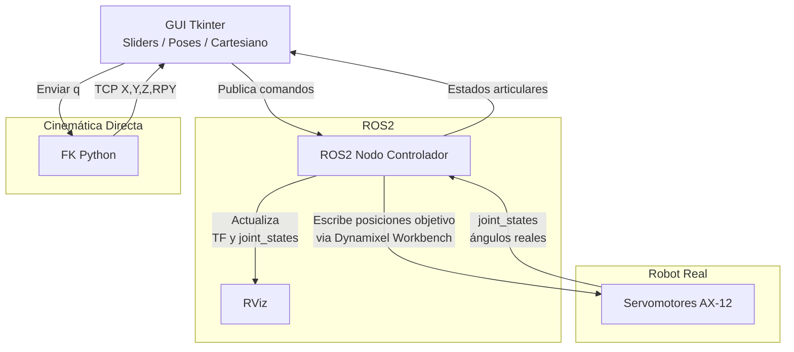

# 🤖 Laboratorio 05 – PhantomX Pincher X100  
### Robótica – 2025-II – Universidad Nacional de Colombia  
INTEGRANTES:
- Ariadna Contreras Nossa
- David Santiago Nagles Barajas

Este repositorio contiene el desarrollo completo del **Laboratorio No. 05**, incluyendo:

- Control del manipulador Phantom X Pincher utilizando **ROS 2 Humble + Dynamixel Workbench**  
- Interfaz gráfica (HMI) construida en **Tkinter + ROS2 Python**  
- Publicación/suscripción a tópicos de control  
- Movimiento secuencial entre poses  
- Control en espacio articular, numérico y cartesiano  
- Visualización en RViz en tiempo real  
- Cinemática directa en MATLAB (Robotics Toolbox)  
- Comparación entre modelo digital y robot real  

---

# 🧑‍🏫 **0. Objetivos del Laboratorio**
- Crear controladores articulares para los servos Dynamixel AX-12.  
- Manipular tópicos y servicios de cada joint controller.  
- Conectar Python + ROS2 con el PhantomX.  
- Validar límites articulares y enviar posiciones objetivo.  
- Graficar las poses en el Toolbox y compararlas con el robot real.  
- Construir una interfaz HMI con múltiples pestañas:
  - Control por sliders (articular)
  - Ingreso numérico
  - Control cartesiano
  - Vista RViz
  - Visualización numérica de la pose cartesiana  
  - Pestaña con las 5 poses del laboratorio  

---
# 📹 **1. Videos del laboratorio**

---

# 🛠️ **2. Repositorios utilizados**
- https://github.com/labsir-un/ROB_Intro_ROS2_Humble_Phantom_Pincher_X100.git
- https://github.com/labsir-un/ROB_Intro_ROS2_Humble_Phantom_Pincher_X100_RVIZ.git

---

# 📏 **3. Mediciones y parámetros DH**

Las longitudes se midieron con calibrador, obteniendo los siguientes parámetros DH:

| Articulación | d (m) | a (m) | α (rad) | θ |
|--------------|-------|--------|----------|-----|
| 1 | 0.046 | 0 | +π/2 | q1 |
| 2 | 0 | 0.107 | 0 | q2 |
| 3 | 0 | 0.107 | 0 | q3 |
| 4 | 0 | 0.066 | 0 | q4 |

📌 Imagen del diagrama del robot:  

  

  

Más del Matlab:
[Ver documento](./DOCS/Lab5Toolbox.mlx)

---

# 🦾 **4. Cinco poses solicitadas**

| Pose | q1 | q2 | q3 | q4 | q5 |
|------|----|----|----|----|----|
| 1 | 0 | 0 | 0 | 0 | 0 |
| 2 | 25 | 25 | 20 | -20 | 0 |
| 3 | -35 | 35 | -30 | 30 | 0 |
| 4 | 85 | -20 | 55 | 25 | 0 |
| 5 | 80 | -35 | 55 | -45 | 0 |

  

  

  

  

  

---

# 🖥️ **5. Interfaz HMI desarrollada**

La interfaz fue construida con **Tkinter** y contiene:

- Panel de información del grupo  
- Vista del robot según última pose enviada  
- Panel de selección de las 5 poses  
- Sliders articulares con límites  
- Ingreso numérico  
- Control cartesiano  
- Vista RViz integrada  
- Valores articulares reales  
- Visualización de la pose cartesiana  

  

  

---

# 📡 **6. Funcionamiento general del sistema (diagrama Mermaid)**

  

  

---

# 🧰 **7. Código del laboratorio**

Código completo:
[Ver documento](./DOCS/control_servo.py)

## **7.1 Funciones principales del controlador ROS2 (`PincherController`)**

### **`dh_transform(a, alpha, d, theta)`**
def dh_transform(self, a, alpha, d, theta):
    """Calcula la matriz de transformación homogénea usando parámetros DH."""
    # Parámetros:
    # - a: longitud del eslabón (m)
    # - alpha: ángulo de torsión (rad)
    # - d: desplazamiento (m)
    # - theta: ángulo de articulación (rad)
    # Retorna: Matriz 4x4 de transformación homogénea

### **`update_tcp_position()`**
def update_tcp_position(self):
    """Calcula la posición del TCP usando cinemática directa con parámetros DH.
    
    Proceso:
    1. Obtiene ángulos actuales q1-q4
    2. Calcula matrices T1, T2, T3, T4 usando dh_transform()
    3. Multiplica matrices: T = T1 @ T2 @ T3 @ T4
    4. Extrae posición (x,y,z) de la columna [0:3,3]
    
    Retorna: Tupla (x, y, z) en metros
    """

### **`dxl_to_radians(dxl_value)` y `radians_to_dxl(radians)`**
def dxl_to_radians(self, dxl_value):
    """Convierte ticks Dynamixel a radianes.
    
    Para AX-12 (Protocolo 1.0):
    - Centro: 512 ticks = 0 rad
    - Rango: ±512 ticks = ±2.618 rad (±150°)
    - Conversión: (dxl_value - 512) × (2.618/512)
    """

### **`publish_joint_states()`**
def publish_joint_states(self):
    """Publica el estado de articulaciones para RViz.
    
    Publica en tópico: /joint_states
    Frecuencia: 10 Hz (timer de 100ms)
    Mensaje: sensor_msgs/JointState con:
        - header.stamp: timestamp actual
        - name: nombres de articulaciones (según URDF)
        - position: valores en radianes
    """

### **`move_motor(motor_id, position_ticks)`**
def move_motor(self, motor_id, position_ticks):
    """Mueve un motor a posición específica en ticks Dynamixel.
    
    Validaciones:
    1. Verifica que no haya parada de emergencia activa
    2. Escribe posición usando Dynamixel SDK
    3. Actualiza estado interno para RViz
    4. Registra en log de ROS2
    """

### **`r2_all_motors(list_q)`**
def r2_all_motors(self, list_q):
    """Mueve múltiples articulaciones con valores en radianes.
    
    Parámetros:
    - list_q: Lista de 4 valores [q1, q2, q3, q4] en radianes
    - Excluye: Motor 5 (pinza) de esta rutina
    
    Proceso:
    1. Convierte radianes → ticks para cada articulación
    2. Envía comandos secuencialmente a motores 1-4
    """

---

## **7.2 Funciones de la interfaz gráfica (`PincherGUI`)**

### **`setup_tab1()` - Control por Sliders**
def setup_tab1(self):
    """Configura pestaña de control con deslizadores.
    
    Elementos por motor:
    - Slider con rango -150° a 150°
    - Label que muestra ángulo actual
    - Actualización en tiempo real con control de frecuencia
    
    Función callback: on_motor_slider_change()
    """

### **`setup_tab2()` - Control por Valores**
def setup_tab2(self):
    """Configura pestaña de ingreso numérico.
    
    Elementos por motor:
    - Entry para ingresar valor en grados
    - Botón "Mover Motor" individual
    - Label de estado (Listo/Enviado/Error)
    - Validación de rango: -150° a 150°
    """

### **`setup_tab3()` - Visualización RViz**
def setup_tab3(self):
    """Configura pestaña de visualización 3D.
    
    Funcionalidades:
    - Botón para lanzar RViz + robot_state_publisher
    - Botón para detener RViz
    - Monitor de posiciones articulares en tiempo real
    - Labels que muestran q1-q5 en grados
    """

### **`setup_tab4()` - Poses Predefinidas**
def setup_tab4(self):
    """Configura pestaña de poses automáticas.
    
    Poses implementadas (en radianes):
    1. Home: [0, 0, 0, 0, 0]
    2. Pose 2: [0.44, 0.44, 0.35, -0.35, 0]
    3. Pose 3: [-0.61, 0.61, -0.52, 0.52, 0]
    4. Pose 4: [1.48, 0.35, 0.96, 0.44, 0]
    5. Pose 5: [1.40, -0.61, 0.96, -0.78, 0]
    """

### **`setup_tab5()` - Cinemática Directa**
def setup_tab5(self):
    """Configura pestaña de cálculo de TCP.
    
    Muestra en tiempo real:
    - Posición X del TCP (mm)
    - Posición Y del TCP (mm)
    - Posición Z del TCP (mm)
    
    Actualización: Cada 50ms (20 Hz)
    """

### **`_move_all_sequence_step()` - Secuenciador**
def _move_all_sequence_step(self, motor_ids_seq, angles_deg_seq, ticks_seq, idx):
    """Ejecuta movimientos secuenciales de forma no bloqueante.
    
    Algoritmo recursivo:
    1. Mueve motor actual (idx)
    2. Programa siguiente movimiento (idx+1) después de 800ms
    3. Se detiene cuando idx == len(seq)
    
    Ventajas:
    - No congela la interfaz
    - Permite cancelación en cualquier punto
    - Timing preciso entre movimientos
    """

---

## **7.3 Funciones de utilidad y conversión**

### **Conversión Dynamixel**
def write_goal_position(packet, port, dxl_id, position):
    """Escribe posición objetivo en motor Dynamixel.
    
    Soporta:
    - Protocolo 1.0 (AX-12): write2ByteTxRx()
    - Protocolo 2.0 (XL-430): write4ByteTxRx()
    """

### **Gestión de velocidades**
def update_speed_single_motor(motor_id, speed):
    """Actualiza velocidad de movimiento de un motor.
    
    Parámetro speed: 0-1023
    - 0: Sin movimiento
    - 1023: Velocidad máxima
    """

---

## **7.4 Funciones de seguridad**

### **Parada de emergencia**
def emergency_stop(self):
    """Activa parada de emergencia.
    
    Acciones:
    1. Desactiva torque en todos los motores
    2. Bloquea envío de nuevos comandos
    3. Actualiza interfaz gráfica (rojo/emergencia)
    4. Requiere reactivación manual
    """

### **Reactivación del sistema**
def reactivate_torque(self):
    """Rehabilita sistema después de emergencia.
    
    Acciones:
    1. Reactiva torque en todos los motores
    2. Permite envío de nuevos comandos
    3. Actualiza interfaz gráfica (verde/listo)
    """

---

## **7.5 Funciones de actualización periódica**

### **`update_joints_timer()`**
def update_joints_timer(self):
    """Actualiza posiciones articulares en GUI cada 100ms.
    
    Lee de: self.controller.current_joint_positions
    Muestra en: Pestañas 3 y 4
    Conversión: radianes → grados
    """

### **`update_tcp_labels()`**
def update_tcp_labels(self):
    """Actualiza posición del TCP en GUI cada 50ms.
    
    Llama a: self.controller.update_tcp_position()
    Muestra en: Pestaña 5
    Conversión: metros → milímetros
    """

---

## **7.6 Resumen de flujos de datos**

| Función | Origen → Destino | Propósito |
|---------|-----------------|-----------|
| `on_motor_slider_change()` | GUI → Motores | Control en tiempo real |
| `publish_joint_states()` | Motores → RViz | Sincronización visual |
| `update_tcp_position()` | Articulaciones → TCP | Cálculo cinemático |
| `_move_all_sequence_step()` | Poses → Movimiento | Secuenciación segura |
| `launch_rviz()` | GUI → RViz | Visualización 3D |

**Nota:** Todas las funciones incluyen manejo de errores, logging detallado y validación de parámetros para garantizar operación segura del robot.

